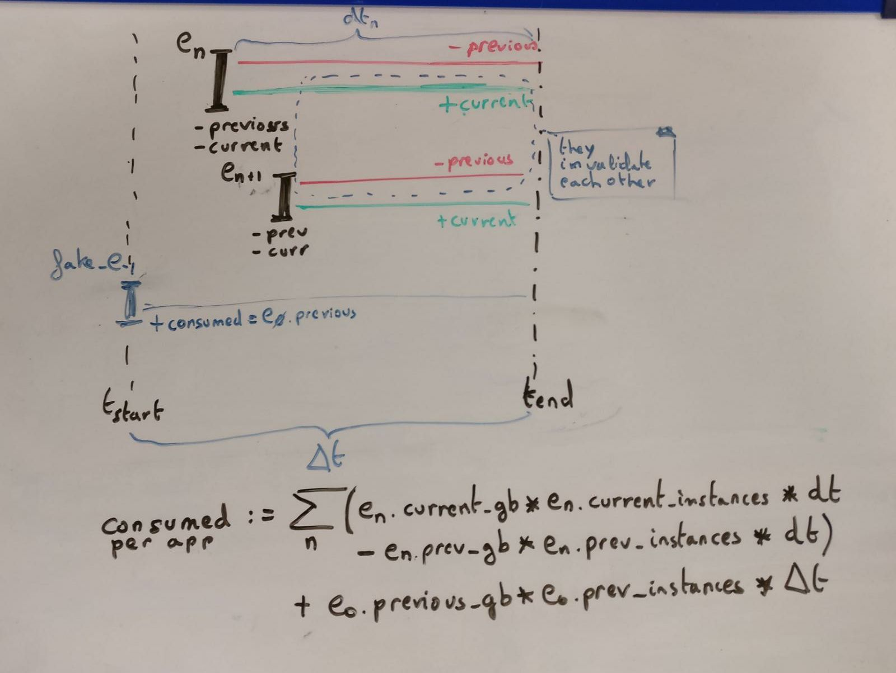

CF app-usage-report using SQL directly
======================================

This repository contain a rough implementation of a CF usage report implemented in SQL directly.

The goal of this repo is generate the reports as done in https://***REMOVED***/usage-reports/browse
in the most quick and simple way possible:

 * We rely on a series of SQL queries to sum all the events from a copy of the data from the table `app_usage_events` of the CF CloudController, which is
the data exposed by the endpoint [`/app_usage_events`](https://docs.cloudfoundry.org/running/managing-cf/usage-events.html).

 * We dump all the data from the environments using bosh2+ssh+psql and import it in a PostgresSQL running on docker.

Usage
-----

> Requirements: docker, pass, access to bosh in the network

To download the data and run the report use `make`:

 * Run `make` to get help
 * Run `make all` to run everything.

Important files and how to work to modify this
-----------------------------------------------

The main files are:

 * `Makefile`: All the tooling
 * `fetch_usage_from_ccdb.sh`:
   - Not to be called directly
   - This script is intended to use in a docker with bosh2, sshpass, etc.
   - It would connect to a bosh2 to do `bosh ssh` into ccdb to export all data as CSV files.
 * `download_all_usage.sh`: Will iterate across each environment, get the credentials and call  `fetch_usage_from_ccdb.sh`
 * `generate_app_usage_report.sql`: Where all the logic resides, as described below. Writes to `data/report.csv`

To play around with the data in the `psql`:

 1. Download all the data with `make download_usage`
 2. Start posgresql `make start_postgresql`
 3. Import the data `make load_data_on_psql`
 4. Start a psql: `make run_psql`
 5. Just copy&paste the queries from `generate_app_usage_report.sql`

Tips developing: Try to filter the number of events in the very first view
`last_month_app_usage_events` to have manageable number of events.

Mathematics behind these queries
--------------------------------

The maths behind these queries are explained in this image:

The idea is as follows, to sum the usage **per app `app_guid`**

 * Given:
	- a list of `N` events per app `E[app_guid]` ordered by creation time.
	- each event contains:
		- `current_usage_gb`: New usage in GB
		- `current_usage_instances`: New number of instances
		- `previous_usage_gb`: Old usage in GB
		- `previous_usage_instances`: Old number of instances
		- `created_at`: When the event is created
		- Stop events will have `#instances = 0`
	- `t_start` and `t_end`: times for the usage window to compute
	- `DT = t_end - t_start`

 * For each event `e[n]` in `E`, sum the result of:
	- Add the usage from `e[n].created_at` to `t_end`
		- `current_usage=(e[n].current_usage_gb * e[n].current_usage_gb) * (t_end - e(n).created_at)`
	- Substract the usage from `e(n).created_at` to `t_end`
		- `previous_usage=(e[n].previous_usage_gb * e[n].previous_usage_gb) * (t_end - e(n).created_at)`

 * Add the usage that has been carried on from events BEFORE `t_start`, for ALL the windows.
	- We know the previous usage because it the `previous_usage` for the first event `e[0]`
	- We must do this for all the window `DT` because we will subtract the value later when computing `e[0]` in the iteration above.
	- `carried_usage = (e[0].previous_usage_gb *  e[n].previous_usage_gb) * (t_end - t_start)`

See the code and comments in `./generate_app_usage_report.sql` to see how this is implemented.

